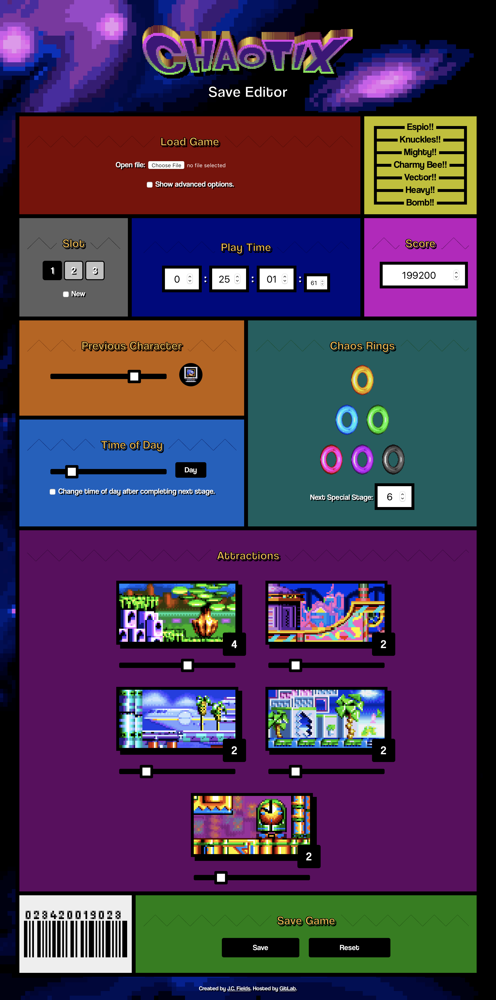
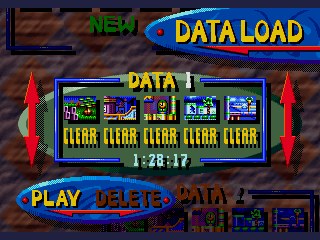

# chaotix-save-editor

A [save game editor for *Knuckles Chaotix*](https://jcfieldsdev.github.io/chaotix-save-editor/). Written in JavaScript. *Knuckles Chaotix* is a platform game released for the Sega Genesis 32X in 1995. The editor is intended for use with emulator saves.

The [saves](https://github.com/jcfieldsdev/chaotix-save-editor/tree/master/saves) directory contains saves in different formats for testing purposes.

## Specifications

- [Save format](https://github.com/jcfieldsdev/chaotix-save-editor/blob/master/save%20format.md)

## Compatibility

### Overview

| | Release | Platform | Year |
| -- | -- | -- | -- |
| ✅ | *Knuckles Chaotix* | Genesis/Mega Drive 32X | 1995 |

### Genesis/Mega Drive 32X

Tested for Gens, Kega Fusion, and PicoDrive saves. May or may not work with other emulators since they vary a bit in how they handle saves.

The "Show advanced options" checkbox reveals some save options that may help with emulator compatibility. The easiest way to set the editor to the proper settings is to open an existing save file.

Different emulators store saved games in different locations, but they generally have the same name as the ROM file and use the `.sav` or `.srm` file extension.

## Acknowledgments

Checksum algorithm taken from [Sonic Retro's *Knuckles Chaotix* disassembly](https://github.com/sonicretro/chaotix) by [andlabs](https://andlabs.dev/).

[*Chaotix*](https://www.spriters-resource.com/genesis_32x_scd/knuckleschaotix32x/) sprite rips taken from [The Spriters Resource](https://www.spriters-resource.com/).

Vectorized Chaotix logo by [Nico Vliek](https://www.behance.net/WhaddupNico).

Uses [Classic Knuckles icon](https://www.deviantart.com/nibroc-rock/art/Vector-Icon-Classic-Knuckles-618813720) by [Nibroc-Rock](https://www.deviantart.com/nibroc-rock).

Uses [Coolvetica](http://typodermicfonts.com/coolvetica/) font by [Typodermic Fonts](https://typodermicfonts.com/).

## Authors

- J.C. Fields <jcfields@jcfields.dev>

## License

- [MIT license](https://opensource.org/licenses/mit-license.php)

## See also

- [*Sonic CD* Save Editor](https://github.com/jcfieldsdev/sonic-cd-save-editor)—A save editor for the Sega CD game *Sonic CD*.
- [*Sonic 3* Save Editor](https://github.com/jcfieldsdev/sonic3-save-editor)—A save editor for the Genesis games *Sonic 3* and *Sonic 3 & Knuckles*.
- [*Tails Adventure* Password Generator](https://github.com/jcfieldsdev/tailsadv-password-generator)—A similar tool for the Game Gear game *Tails Adventure*.
- [*Sonic Mania* Save Editor](https://github.com/jcfieldsdev/sonic-mania-save-editor)—A save editor for *Sonic Mania*.
